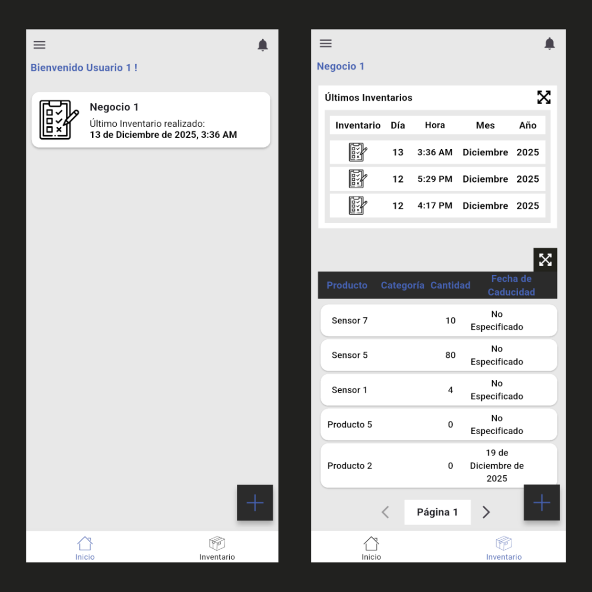
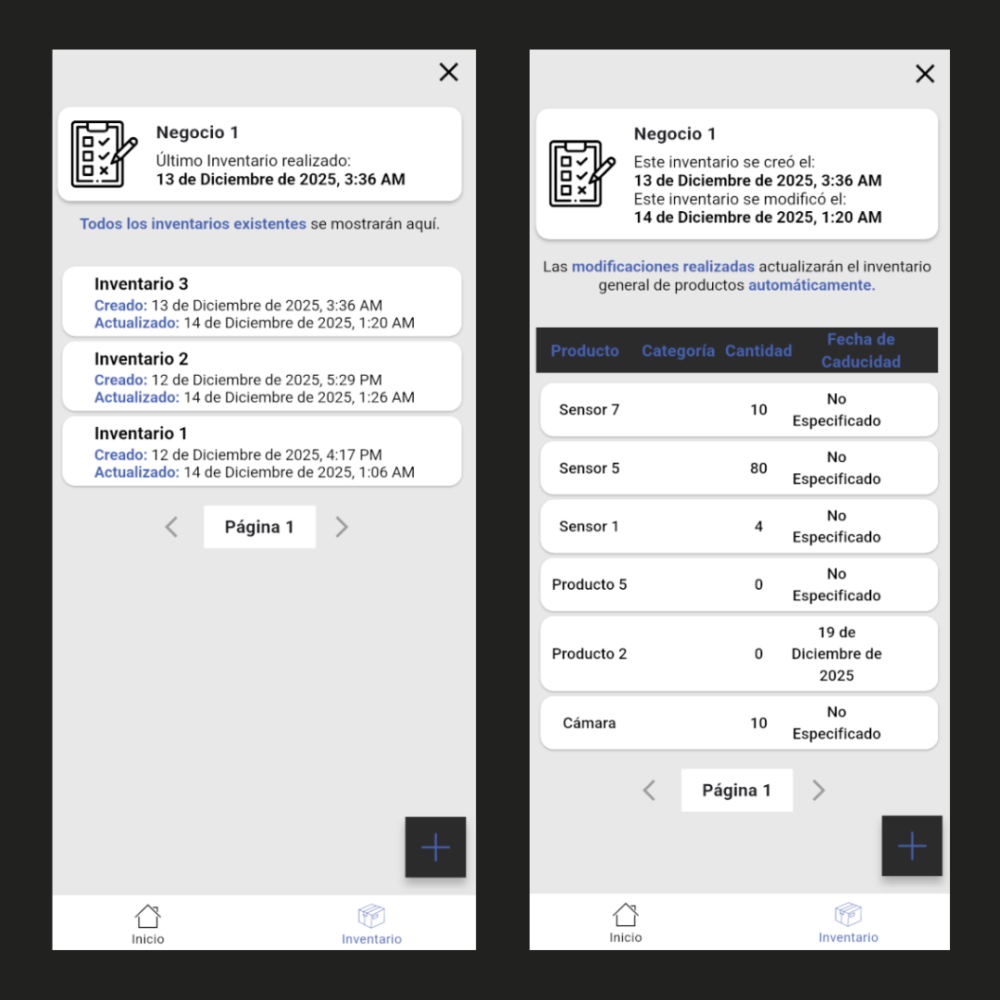

# App para Inventarios

<p align="center">
  
</p>

# Descripción
Esta es una app que simplifica la elaboración de inventarios. Esta app esta enfocada en el sistema android para smartphones. Los datos generados son almacenados en Google Cloud. 

<p align="center">
  
  
</p>

## Características
- Aplicación para sistemas `android`.
- Esta aplicación fue construida usando el patrón de diseño BLoC. 
- Aplicación desarrollada con el framework de ``flutter``.
- Backend en la nube de google cloud mediante `Firebase`.
- Autenticación de usuarios mediante `Firebase Authentication API`.
- Registro e inicio de sesión mediante cuentas de Google
- Base de datos NoSQL `Firestore`.

## Estructura del Proyecto
```markdown
APP_INVENTARIO/lib/
│
├── main.dart                        # Punto de entrada
├── app.dart                         # Configuración de MaterialApp, rutas, temas
│
├── core/                            # Utilidades comunes y configuraciones
│   └── utils/                       # Funciones o clases de ayuda
│
├── logic/                           # BLoCs
│   ├── auth/                        # BLoC de autenticación
│   │   ├── auth_bloc.dart           # Logica del BLoC
│   │   ├── auth_event.dart          # Eventos del BLoC
│   │   └── auth_state.dart          # Estados del BLoC
│   ├── inventario/                  # BLoC para los inventarios
│   ├── navigation/                  # BLoC para la navegación entre pantallas
│   └── producto/                    # BLoC para los productos
│
├── models/                          # Clases para representar los datos y la interacción con estos
│
├── presentation/                    # UI
│   ├── screens/                     # Pantallas de la app
│   │   ├── login_screen/
│   │   ├── home_screen/
│   │   └── ...
│   └── widgets/                     # Widgets reutilizables
│
└── services/                        # Servicios
```

## Ambiente
- Sistema Windows 10

## Paquetes

1. Instalar flutter_bloc: 
  ```sh
  flutter pub add flutter_bloc
  ```

2. Instalar flutter_speed_dial: 
  ```sh
  flutter pub add flutter_speed_dial
  ```

3. Instalar firebase_core: 
  ```sh
  flutter pub add firebase_core
  ```

4. Instalar firebase_auth: 
  ```sh
  flutter pub add firebase_auth
  ```

5. Instalar equatable: 
  ```sh
  flutter pub add equatable
  ```

6. Instalar google_sign_in: 
  ```sh
  flutter pub add google_sign_in
  ```

7. Instalar cloud_firestore: 
  ```sh
  flutter pub add cloud_firestore
  ```

8. Instalar flutter_launcher_icons: 
  ```sh
  flutter pub add flutter_launcher_icons
  ```

## Guía para configurar el proyecto

1. Instalar Flutter.

2. Instalar Firebase CLI.

3. Generar y colocar tu archivo `google-services.json` dentro de `android/app/`.

4. Habilitar los servicios a utilizar en la consola de Firebase.

## Referencias
- NVM for Windows: https://github.com/coreybutler/nvm-windows
- Install Firebase CLI: https://firebase.google.com/docs/cli
- Documentación Flutter: https://api.flutter.dev/index.html
- Flutter Widget: https://docs.flutter.dev/get-started/fundamentals/widgets#building-widgets
- Instalar Flutter: https://docs.flutter.dev/install
- flutter_bloc: https://pub.dev/packages/flutter_bloc
- Primeros pasos con Cloud Firestore: https://firebase.google.com/docs/firestore/quickstart?authuser=0&hl=es-419#dart
- Reglas de Seguridad Cloud Firestore: https://firebase.google.com/docs/firestore/security/get-started?hl=es-419&authuser=0
- Agregar Firebase a una app de Flutter: https://firebase.google.com/docs/flutter/setup?authuser=0&hl=es-419&platform=ios
- Costo de planes de Firebase: https://firebase.google.com/pricing
- Límites de la capa gratuita de Google Cloud: https://cloud.google.com/free?hl=en